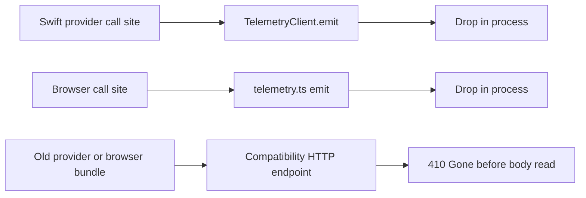

# Telemetry

Client-supplied telemetry is disabled. Provider and browser events are dropped
locally, and both compatibility HTTP endpoints return `410 Gone` before reading
a request body. The retained event types, allowlists, queue methods, and facade
APIs are compatibility surfaces; they are not an active provider/browser data
path.

Coordinator-generated operational telemetry is separate and remains active. It
is created inside the coordinator, mirrored to the process logger and metrics,
and may be forwarded to Datadog. It does not accept provider or browser event
payloads ([`coordinator/telemetry/emitter.go`, `Emitter.Emit`](../../../coordinator/telemetry/emitter.go#L61-L119)).

## Canonical code

### Disabled client-ingestion path

- Coordinator route wiring: [`coordinator/api/server.go`](../../../coordinator/api/server.go#L1919-L1922)
- Coordinator `410` handler: [`handleTelemetryIngest`](../../../coordinator/api/telemetry_handlers.go#L261-L269)
- Swift disabled client: [`TelemetryClient`](../../../provider-swift/Sources/ProviderCore/Telemetry/TelemetryClient.swift#L50-L103)
- Swift disabled compatibility queue: [`TelemetryOverflowQueue`](../../../provider-swift/Sources/ProviderCore/Telemetry/TelemetryOverflowQueue.swift#L11-L59)
- Common locked startup cleanup: [`ProcessLifecycle.acquireMediaServingLock`](../../../provider-swift/Sources/ProviderCore/Service/ProcessLifecycle.swift#L68-L104)
- Swift crash hook: [`PanicHook`](../../../provider-swift/Sources/ProviderCore/Telemetry/PanicHook.swift#L19-L101)
- TypeScript disabled facade: [`console-ui/src/lib/telemetry.ts`](../../../console-ui/src/lib/telemetry.ts#L1-L26)
- TypeScript `410` route: [`console-ui/src/app/api/telemetry/route.ts`](../../../console-ui/src/app/api/telemetry/route.ts#L1-L17)

### Retained compatibility schema

- Canonical Go wire types: [`coordinator/protocol/telemetry.go`](../../../coordinator/protocol/telemetry.go#L15-L146)
- Swift mirror: [`provider-swift/Sources/ProviderCore/Telemetry/TelemetryEvent.swift`](../../../provider-swift/Sources/ProviderCore/Telemetry/TelemetryEvent.swift#L14-L317)
- TypeScript mirror: [`console-ui/src/lib/telemetry-types.ts`](../../../console-ui/src/lib/telemetry-types.ts#L1-L172)
- Historical Go parser and field allowlist: [`coordinator/api/telemetry_handlers.go`](../../../coordinator/api/telemetry_handlers.go#L31-L190)

The Go, Swift, and TypeScript event definitions remain aligned because old
binaries and source call sites still compile against them. Their parity tests
protect that compatibility contract. They do **not** imply that client event
ingestion is enabled.

## Disabled flow

The coordinator registers `POST /v1/telemetry/events` directly to
`handleTelemetryIngest` ([route wiring](../../../coordinator/api/server.go#L1919-L1922)).
That handler writes only the fixed `telemetry_ingest_disabled` error response;
it does not read, decode, store, log, or forward the body
([handler](../../../coordinator/api/telemetry_handlers.go#L261-L269)).

The browser compatibility route behaves the same way. Its `POST` function does
not access the `NextRequest`; it returns the fixed error with status 410
([route](../../../console-ui/src/app/api/telemetry/route.ts#L5-L16)). The browser
facade's `emit`, global-handler installation, and test reset methods are no-ops,
and its reported buffer size is always zero
([facade](../../../console-ui/src/lib/telemetry.ts#L17-L26)).

## Swift client and legacy queue

`TelemetryClient` retains configuration and emission signatures so existing
call sites keep compiling, but both `emit` overloads discard their arguments.
`setAuthToken`, `setMachineId`, and `setAccountId` also retain compatibility
signatures without storing their values
([`TelemetryClient`](../../../provider-swift/Sources/ProviderCore/Telemetry/TelemetryClient.swift#L57-L82)).
No event is encoded, buffered, written to disk, or sent over the network.

Legacy cleanup is intentionally narrow and shared by both serving modes:

- `ProcessLifecycle.acquireMediaServingLock` acquires the single-instance lock,
  then purges the legacy telemetry queue and legacy video files in that order.
  Both standalone and coordinator-connected startup call this common seam
  ([locked housekeeping](../../../provider-swift/Sources/ProviderCore/Service/ProcessLifecycle.swift#L68-L104),
  [standalone call](../../../provider-swift/Sources/darkbloom/StartCommand+Modes.swift#L78-L82),
  [connected call](../../../provider-swift/Sources/darkbloom/StartCommand+Modes.swift#L182-L187)).
- `TelemetryClient.configure`, `shutdown`, and `shutdownSync` are compatibility
  no-ops; they cannot create a second cleanup path or revive persistence
  ([disabled client](../../../provider-swift/Sources/ProviderCore/Telemetry/TelemetryClient.swift#L57-L85)).
- `push` drops its event and `drain` always returns an empty array
  ([queue no-ops](../../../provider-swift/Sources/ProviderCore/Telemetry/TelemetryOverflowQueue.swift#L27-L36)).
- `purge` removes only the historical `telemetry-queue.jsonl` path and its exact
  `.tmp` companion when each is a regular, non-symlink file. It does not create
  a directory, lock file, or replacement artifact when neither exists
  ([queue purge](../../../provider-swift/Sources/ProviderCore/Telemetry/TelemetryOverflowQueue.swift#L38-L59)).

`TelemetryClient.ingestEndpoint` remains only for compatibility tests and UI
that displays the historical URL; production code does not send to the returned
endpoint ([`ingestEndpoint`](../../../provider-swift/Sources/ProviderCore/Telemetry/TelemetryClient.swift#L87-L102)).

## Panic hook

`PanicHook.install` registers handlers for `SIGSEGV`, `SIGBUS`, `SIGILL`,
`SIGABRT`, and `SIGFPE`, plus an uncaught Objective-C exception handler
([installation](../../../provider-swift/Sources/ProviderCore/Telemetry/PanicHook.swift#L24-L48)).
The recording path constructs a compatibility `TelemetryEvent`, but
`TelemetryOverflowQueue.push` is a no-op and
`TelemetryClient.shutdownSync` is also a no-op. The common locked startup seam
has already removed eligible legacy queue artifacts. No crash event or stack is
persisted or transmitted
([recording calls](../../../provider-swift/Sources/ProviderCore/Telemetry/PanicHook.swift#L79-L99),
[disabled queue](../../../provider-swift/Sources/ProviderCore/Telemetry/TelemetryOverflowQueue.swift#L27-L35),
[disabled shutdown](../../../provider-swift/Sources/ProviderCore/Telemetry/TelemetryClient.swift#L83-L85),
[startup cleanup](../../../provider-swift/Sources/ProviderCore/Service/ProcessLifecycle.swift#L68-L104)).

The remaining local output is one bounded stderr marker with a fixed format:
`FATAL panic kind=<closed category> message=<closed signal/exception label>`.
It includes a local timestamp but never an Objective-C exception reason, request
value, URL, model identifier, or stack
([marker](../../../provider-swift/Sources/ProviderCore/Telemetry/PanicHook.swift#L95-L100),
[exception redaction](../../../provider-swift/Sources/ProviderCore/Telemetry/PanicHook.swift#L37-L46)).

For POSIX signals, the handler then restores the default disposition and
re-raises the same signal. The process therefore retains its real signal exit
status and Apple's CrashReporter can write the authoritative crash report
([re-raise](../../../provider-swift/Sources/ProviderCore/Telemetry/PanicHook.swift#L68-L75)).
The Objective-C exception callback records the same bounded marker; the signal
re-raise sequence applies specifically to the POSIX handler.

## Historical schema and allowlists

`TelemetryEvent`, `TelemetryBatch`, enum mirrors, parser caps, rate limiter, and
field allowlists remain in source for compatibility. Because active endpoints
return 410 before body access, those parser limits and filters are not an active
confidentiality control. Phrases such as "accepted field," "server cap," or
"coerced enum" in the schema reference describe how the retired parser would
process an event if ingestion were deliberately re-enabled after a new privacy
review.

The historical schema includes free-form `message` and `stack` fields plus
arbitrary field values. A field-name allowlist cannot prove those values are
safe. Re-enabling client ingestion requires closed, per-kind value schemas and a
new confidentiality review; changing only the retained allowlists is
insufficient.
